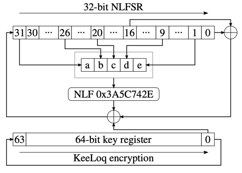
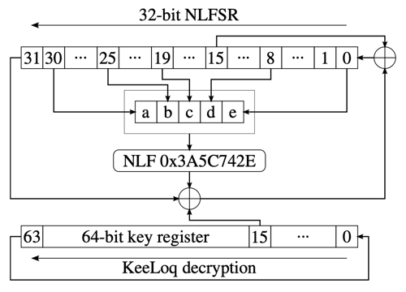

# KeeLoq

An implementation of KeeLoq encryption/decryption in Go programming language.

## What is KeeLoq

KeeLoq is a proprietary block cipher owned by [Microchip](https://www.microchip.com/), developed for code-hopping remote key entry (RKE)
devices such as:

- [Microchip HCS200](http://ww1.microchip.com/downloads/en/devicedoc/40138c.pdf)
- [Microchip HCS301](http://ww1.microchip.com/downloads/en/devicedoc/21143b.pdf)
- [EG Micro EG301](https://www.egmicro.com/download/EG301_datasheet.pdf)

and is used in remote key-less entry systems from several car manufacturers - such as [Chrysler](https://www.chrysler.com/), 
[Fiat](https://www.fiat.com/), [GM](https://www.gm.com/), [Honda](https://www.honda.com/), [Toyota](https://www.toyota.com/), 
[Volvo](https://www.volvocars.com/intl), [VW](https://www.vw.com/), [Jaguar](https://www.jaguar.com/index.html), 
[Iran Khodro](https://www.ikco.ir/en/), etc. - as well as for garage door openers.

After the confidential specifications have been leaked on a Russian website ([Code Hopping Decoder using a PIC16C56](http://keeloq.narod.ru/decryption.pdf)) in 2006,
several cryptanalysts have found substantial weaknesses in the design of the algorithm and the hardware on which it is implemented ([Robert R. Enderlein, S Vaudenay, P Sepehrdad. KeeLoq. EPFL, Semester Project 2010.](http://www.e7n.ch/data/e10.pdf)).

Please note this algorithm is pretty weak and should not be used for any real crypto.

## KeeLoq Encryption
KeeLoq is a block cipher with a 64-bit key and a 32-bit block size. The cipher operates on two registers for 528 clock cycles to produce the ciphertext, based on the following shape:

## KeyLoq Decryption
KeeLoq decryption algorithm operates on two registers for 528 rounds, to produce the plaintext for a given key and ciphertext, according to the following shape.

## Test Vectors

| key                  | plaintext    | ciphertext   |
|----------------------|--------------|--------------|
| `0xbeefdeadbeefdead` | `0x2000c022` | `0x054c90c2` |
| `0x5cec6701b79fd949` | `0xf741e2db` | `0xe44f4cdf` | 
| `0x5cec6701b79fd949` | `0x0ca69b92` | `0xa6ac0ea2` |                               